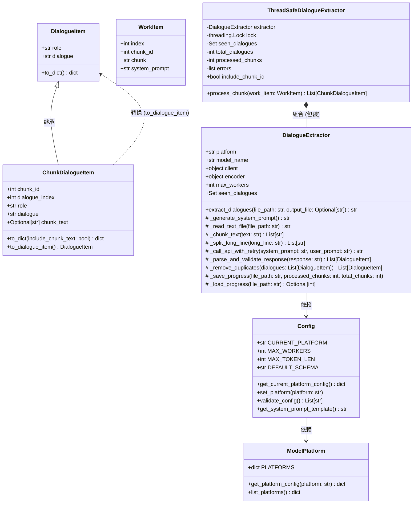

# 类关系图

## 项目类图

## 设计模式说明

| 设计模式 | 类 | 说明 |
|---------|---|------|
| 装饰器模式 | `ThreadSafeDialogueExtractor` → `DialogueExtractor` | 包装原始提取器，添加线程安全功能 |
| 单例模式 | `Config` | 类变量保存全局| 工厂模式配置 |
 | `DialogueExtractor._parse_and_validate_response` | 创建 DialogueItem 对象 |

## 类职责

| 类 | 职责 |
|---|------|
| `DialogueItem` | 对话数据的基本结构 |
| `ChunkDialogueItem` | 带分块信息的对话数据 |
| `WorkItem` | 线程池工作单元 |
| `Config` | 统一管理所有配置 |
| `ModelPlatform` | 管理支持的 AI 平台 |
| `DialogueExtractor` | 核心对话提取逻辑 |
| `ThreadSafeDialogueExtractor` | 线程安全的提取器包装 |

**Validation Status**: ✅ Validated successfully
